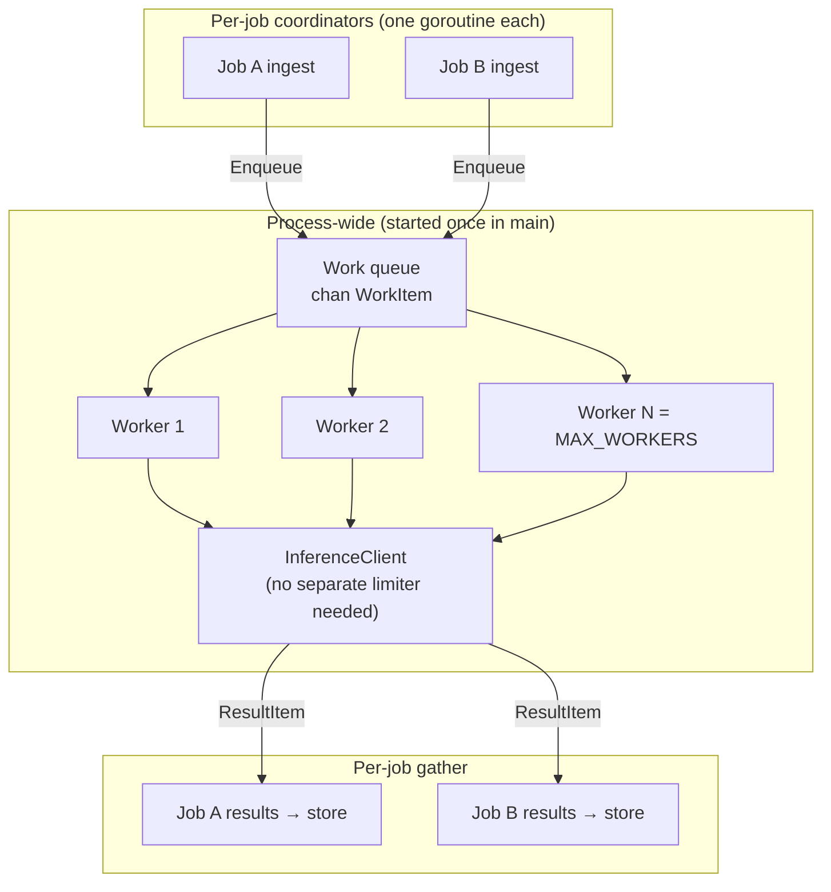

# Architecture & Design Decisions

Living document for the DigitalOcean batch inference interview.  
Use this when walking the interviewer through the codebase: **what we chose, what we rejected, and why**.

Last updated: after global limiter + Steps 16–17. Phase 2 global queue is **sketched, not implemented**.

---

## How to use this in the review

1. Start with [Executive summary](#executive-summary) (30 seconds).
2. Walk the [decision table](#decision-log) for anything they ask about.
3. Point to code paths listed under each decision.
4. Be honest about [open questions](#open-questions-for-interviewer) you still want to confirm.

---

## Executive summary

We are building a **custom scatter-gather batch engine in Go** that:

- Accepts a **local JSONL file** (1000 prompt lines),
- Returns a **job ID immediately** and processes in the background,
- Calls **DigitalOcean Serverless Inference** (`inference.do-ai.run`) from a **bounded worker pool**,
- Retries **429 / 5xx** with **custom exponential backoff + jitter**,
- Persists state and results **on disk** (not in memory),
- Exposes **status** and **streaming download** APIs.

We deliberately **do not** wrap DO’s managed Batch Inference API (`/v1/batches/*`) — building the orchestration layer is the exercise.

---

## Decision log

| # | Decision | Choice | Status | Why |
|---|----------|--------|--------|-----|
| D1 | Language | **Go** | Implemented | Strong concurrency (goroutines + channels), stdlib HTTP, fast compile/test loop, good fit for worker pools. Python scaffold was replaced early. |
| D2 | Upstream inference | **DO Serverless Inference** (`POST …/v1/chat/completions`) | Implemented | Interviewer confirmed DO endpoint + Model Access Key. OpenAI-compatible request shape. |
| D3 | Orchestration | **Build our own** worker pool + job lifecycle | Implemented | Spec / interviewer: do **not** delegate batch orchestration to DO Batch API. We own submit/status/download. |
| D4 | Input format | **JSONL** (1000 lines, one object per line) | Implemented | Interviewer clarified vs original spec’s JSON array. Enables O(1) memory streaming via `bufio.Scanner`. |
| D5 | Input filename | **`sample_batch.jsonl`** | Implemented | Keeps `.jsonl` extension honest. README notes divergence from spec’s `sample_batch.json` wording. |
| D6 | HTTP router | **chi** (`go-chi/chi/v5`) | Implemented | Lightweight, stdlib-compatible, middleware support. Avoids heavier frameworks under time pressure. |
| D7 | Config loading | **Env vars** via `internal/config` | Implemented | 12-factor style; easy to inject DO key in `.env` without code changes. No flag parsing needed for interview scope. |
| D8 | Secrets | **`DO_MODEL_ACCESS_KEY` in `.env` only** | Implemented | Never committed. Tests/CI use mocks. Live key for manual demo only. |
| D9 | Job persistence | **Disk: `meta.json` + active/chunked JSONL results** | Implemented | Survives process restarts; avoids holding full result sets in RAM. Matches scaling story for 100K–500K rows. |
| D10 | Job IDs | **`github.com/google/uuid`** | Implemented | Standard, collision-safe IDs without rolling our own. |
| D11 | Ingest parsing | **`bufio.Scanner` + line JSON decode** | Implemented | Simple JSONL reader; constant memory per row. Malformed lines emit errors but don’t abort the file scan. |
| D12 | Backoff | **Custom `internal/worker/backoff`** | Implemented | Interview asks to demonstrate 429 handling. ~100 lines, fully tested, honors `Retry-After`. Libraries (`cenkalti/backoff`, `go-retryablehttp`) exist but custom code shows understanding. **Decision reaffirmed:** keep custom helper. |
| D13 | Retryable HTTP codes | **429, 500, 502, 503, 504** | Implemented | Rate limits + transient upstream failures. **4xx (except 429)** → permanent row failure, no retry. |
| D14 | Backoff formula | `min(max, initial × 2^attempt) + jitter(0–25%)` | Implemented | Spread retries under parallel load; jitter reduces thundering herd across workers. |
| D15 | CI/CD | **GitHub Actions** (`go vet`, `go test -race`, `go build`) | Implemented | Spec requirement. Temporarily removed during billing issue, restored once fixed. |
| D16 | Commit strategy | **Small steps → test → commit → push** | Ongoing | Frequent reviewable diffs; easier to explain timeline to interviewer. |
| D17 | Testing | **`httptest` mock inference in CI** | Implemented (Step 8) | No live API spend in CI; deterministic tests for 429/500/400 paths. |
| D18 | Worker concurrency | **Fixed worker goroutines + global inference limiter (`MAX_WORKERS`)** | Implemented | Per-job pool fans out work; `LimitedCompleter` enforces a process-wide cap on live DO calls when multiple jobs run. |
| D19 | Chunk size | **`CHUNK_SIZE=50` (config)** | Implemented | Seals local `chunks/chunk_N.jsonl` every N rows; uploads when Spaces configured. |
| D20 | Partial failures | **Job status `partial` + per-row `error` in results** | Implemented | Spec requires isolated row failures; successful rows still complete and failed rows are visible in downloaded output. |
| D21 | Download | **Stream merge from active/chunked JSONL result files** | Implemented | Never `json.Marshal` full result slice — O(1) memory at download time. |
| D22 | DO Spaces extension | **Optional chunk upload (P2)** | Implemented | S3-compatible upload via `internal/storage/spaces.go` when `SPACES_*` env set. |
| D23 | Webhook extension | **Optional callback_url (P2)** | Implemented | POST completion payload via `internal/webhook/notifier.go` on terminal status. |
| D24 | Model name | **`llama3.3-70b-instruct` in `.env.example`** | Config default | Placeholder until key scope confirmed; trivial to change via env. |
| D25 | Code comments | **Package docs + design rationale in code** | Implemented | Helps live code walkthrough with interviewer; see package comments and DECISIONS.md. |
| D26 | Multi-job execution model | **Per-job pool today → global work queue (Phase 2 sketch)** | Sketch only | See [Global work queue sketch](#global-work-queue-sketch-phase-2). Limiter (D18) caps DO calls; global queue caps goroutines + queued memory. |

---

## Code commenting approach

Comments focus on **why**, not **what**:

- **Package comments** — purpose of each `internal/*` package
- **Exported symbols** — godoc on public API
- **Non-obvious mechanics** — dual-channel ingest, per-job mutex, atomic meta write, backoff formula
- **Interview hooks** — references to spec requirements (429 retry, JSONL, partial failures)

Avoid restating obvious code (`i++ // increment i`). Update comments when behavior changes.

---

### Platform & interview constraints

| Topic | Decision | Rationale |
|-------|----------|-----------|
| Workspace | All code in `/workspaces/batch-inference-engine` | Mandatory interview environment rule. |
| Submission | Push to personal GitHub repo | Required before timer ends; repo: `github.com/amit-chahar/batch-inference-engine`. |
| AI tooling | Cursor / Copilot allowed; we review all output | Interviewer expects candidate to explain architecture, not just generated code. |

### Why Go over Python?

- Initial scaffold was Python/FastAPI; switched to **Go** before feature work.
- **Why:** native concurrency for scatter-gather, single static binary, race detector in CI, aligns with common DO infra language choices.
- **Tradeoff:** more boilerplate for JSON/API types vs Python; acceptable for performance-critical worker pool.

### Why JSONL over JSON array?

| JSON array | JSONL (chosen) |
|------------|----------------|
| Requires streaming token parser or full-file load | One `Scanner` line at a time |
| Spec text mentioned array | Interviewer clarified JSONL |
| Harder to append partial progress | Natural append-only logs |

**Code:** `internal/ingest/reader.go`, `sample_batch.jsonl`, `scripts/generate_batch.go`

### Why disk-backed job store?

| In-memory job map | Disk store (chosen) |
|-------------------|---------------------|
| Lost on crash | `meta.json` + `results.jsonl` survive |
| OOM at large N | Results streamed/appended |
| Harder to demo scaling story | Matches 500K-row narrative |

**Layout:**
```
data/jobs/{uuid}/
  meta.json       # status, counters, timestamps
  results.jsonl   # one PromptResult per line
```

**Code:** `internal/job/store.go` — per-job mutex for concurrent appends.

### Why custom backoff (not a library)?

Considered: `cenkalti/backoff`, `hashicorp/go-retryablehttp`.

**Kept custom because:**
- Interview explicitly tests rate-limit **backpressure** understanding.
- Easy to unit test attempt 0/1/2, cap, jitter, `Retry-After` in isolation.
- Will be wired in `internal/worker/inference.go` (Step 8) — clear call path for review.

**Code:** `internal/worker/backoff.go` → (planned) `internal/worker/inference.go`

### Why chi router?

- Minimal API surface (`/health` today; `/job/*` coming).
- Standard middleware (request ID, recoverer).
- **Rejected:** gin/echo — heavier; stdlib mux alone — awkward path params for `/job/{id}/status`.

**Code:** `internal/api/router.go`, `internal/api/handlers.go`

### Config defaults (tunable without recompile)

| Variable | Default | Why |
|----------|---------|-----|
| `MAX_WORKERS` | 10 | Balance throughput vs DO rate limits during demo |
| `CHUNK_SIZE` | 50 | Seal local result chunks; upload to Spaces when configured |
| `MAX_RETRIES` | 5 | Enough for 429 storms without infinite loops |
| `INITIAL_BACKOFF_SECONDS` | 1 | Fast first retry |
| `MAX_BACKOFF_SECONDS` | 60 | Cap wait per attempt |
| `PORT` | 8080 | Common dev port (health was 8000 in early scaffold — now config-driven) |

**Code:** `internal/config/config.go`, `.env.example`

---

## What we explicitly did NOT do (and why)

| Rejected | Reason |
|----------|--------|
| DO managed Batch API (`/v1/batches/*`) | Interviewer: build orchestration ourselves |
| Load full batch / full results in memory | OOM risk at 500K; spec asks for scaling reasoning |
| Live inference in CI | Cost, flakiness, key exposure — mocks instead |
| Commit `.env` or API keys | Security; `.gitignore` blocks it |
| OpenRouter / third-party inference (as default) | DO interview → DO Serverless Inference endpoint |
| Large framework stack | Time-boxed interview; prefer stdlib + small deps |

---

## Priority tiers (time management)

| Tier | Scope | Rationale |
|------|-------|-----------|
| **P0** | Health, submit, runner, workers, backoff, status, download, README, diagram, CI | Minimum viable submission |
| **P1** | Disk store, streaming ingest/download, E2E httptest | Production credibility |
| **P2** | DO Spaces spill, webhook callback | Spec extensions — only if ahead |

---

## Implementation progress (maps to commits)

| Step | Topic | Commit (on `main`) | Decision refs |
|------|-------|-------------------|---------------|
| 1–2 | Scaffold + config | `1ecba51`, `ce8cb42` | D1, D7, D8 |
| 3 | chi + types | `77a6f11` | D6 |
| 4 | JSONL sample | `25c6fe7` | D4, D5 |
| 5 | Streaming ingest | `0fb4860` | D4, D11 |
| 6 | Disk job store | `175596b` | D9, D10 |
| 7 | Backoff helper | `83d1f05` | D12, D13, D14 |
| 8 | DO inference client | `d275210` | D2, D17 |
| 9 | Bounded worker pool | *this commit* | D18 |
| 10 | Background runner | *this commit* | D3 partial |

---

## Open questions for interviewer

Confirm these if they come up in review — document answers here after the conversation:

| # | Question | Our current assumption |
|---|----------|------------------------|
| 1 | Are DO Spaces + webhook **required** or bonus? | **Bonus (P2)** — ask if time remains |
| 2 | Partial job completion: status `partial` vs `completed` with row errors? | **`partial`** when any row fails |
| 3 | Exact model string for the provided key? | Set `INFERENCE_MODEL` in `.env` to key’s scoped model |
| 4 | Submit body: filename relative to repo root? | **`{"input_file": "sample_batch.jsonl"}`** local path |
| 5 | Download while job still running — allow or 409? | **409 Conflict** (planned) |

---

## Talking points for scaling (500K rows)

Use these if asked about memory — they match our design intent:

1. **Input:** JSONL + line scanner → O(1) memory per row (`internal/ingest`).
2. **Execution:** Bounded worker pool → O(`MAX_WORKERS`) concurrent responses in flight.
3. **Output:** Append-only `results.jsonl` → never materialize full array.
4. **Status:** Counters in `meta.json` only → O(1) metadata.
5. **Download:** Stream lines into JSON array response → merge without loading all results.
6. **Multi-job:** Process-wide inference limiter (`LimitedCompleter`) caps live DO calls at `MAX_WORKERS`. For many concurrent jobs, promote to a **global work queue** (sketch below) to avoid `jobs × MAX_WORKERS` goroutines and per-job channel buffering.

---

## Global work queue sketch (Phase 2)

**Status:** design only — not implemented. Current code uses **per-job pools + global inference limiter** (commit `3d88ccc`), which is sufficient for the single-job interview demo.

### Problem with per-job pools at multi-tenant scale

With **J** concurrent jobs and `MAX_WORKERS=10`:

| Resource | Per-job pool (today) | Global queue (Phase 2) |
|----------|----------------------|-------------------------|
| Live DO calls | ≤ 10 (limiter) | ≤ 10 (fixed workers) |
| Worker goroutines | **J × 10** | **10** (fixed) |
| Queued items in memory | **J × (channel buffer)** | **1 shared buffer** (configurable cap) |
| Fairness across jobs | Large job can fill limiter | Explicit round-robin / per-job caps |

The limiter fixes **upstream concurrency**; a global queue fixes **process footprint and backpressure** when many jobs run at once.

### Target architecture



Each job still **streams JSONL** locally (O(1) input memory). Only **work units** enter the shared queue.

### Core types (proposed)

```go
// internal/worker/global_pool.go

type WorkItem struct {
    JobID string
    Item  job.PromptItem
}

type ResultItem struct {
    JobID  string
    Result job.PromptResult
}

type GlobalPool struct {
    work     chan WorkItem      // bounded: e.g. MAX_WORKERS * 4
    results  chan ResultItem    // fan-in from all workers
    completer ItemCompleter
    workers  int
}

func NewGlobalPool(workers int, queueDepth int, completer ItemCompleter) *GlobalPool
func (p *GlobalPool) Start(ctx context.Context)  // spawn N worker goroutines once
func (p *GlobalPool) Enqueue(ctx context.Context, item WorkItem) error
func (p *GlobalPool) Results() <-chan ResultItem
```

```go
// internal/runner/job_session.go — one active job

type JobSession struct {
    jobID       string
    remaining   int64          // atomic: items left to process
    resultSink  chan ResultItem // optional; or demux in coordinator
    done        chan struct{}
}

func (r *Runner) ProcessAsync(jobID, inputFile string) {
    go r.runJob(context.Background(), jobID, inputFile)
}

func (r *Runner) runJob(ctx context.Context, jobID, inputFile string) {
    // 1. SetStatus(running)
    // 2. Stream ingest → globalPool.Enqueue(WorkItem{jobID, item})
    // 3. Separate goroutine (or shared demux): read Results(), filter jobID, persist
    // 4. When remaining == 0 → finalize (chunk seal, webhook)
}
```

### Wiring in `main.go`

```go
pool := worker.NewGlobalPool(cfg.MaxWorkers, cfg.MaxWorkers*4, inferenceClient)
pool.Start(context.Background())

runner := runner.NewWithOptions(runner.Options{
    Store:      store,
    GlobalPool: pool,           // replaces per-job worker.Pool
    ChunkSize:  cfg.ChunkSize,
    // ...
})
```

`LimitedCompleter` becomes **optional** once worker count == inference cap (same semaphore, one layer).

### Job lifecycle / completion tracking

```
Submit
  → CreateJob, total_items = N
  → runJob goroutine
       ingest enqueues N work items (or N + ingest errors as failed rows)
       remaining = N (or total rows including parse failures)
  → demux loop:
       on ResultItem for jobID: persist, decrement remaining
       when remaining == 0: finalize(status, webhook)
```

Use `sync/atomic` for `remaining` — no mutex on hot path.

### Backpressure

| Knob | Purpose |
|------|---------|
| `GlobalPool.work` buffer size | Cap total queued items process-wide |
| `Enqueue` blocks when full | Ingest goroutine stalls → natural backpressure on file read |
| Optional `MAX_QUEUED_PER_JOB` | Prevent one 500K job from monopolizing queue |

### Fairness (MVP+)

Simple upgrade after MVP FIFO queue:

- **Round-robin enqueue** from multiple job ingest loops, or
- **Per-job sub-queues** drained fairly by a scheduler goroutine.

Not required for interview; mention as Phase 2b.

### Migration from current code

| Step | Change | ~Effort |
|------|--------|---------|
| 1 | Add `GlobalPool` + tests (mock completer, peak concurrency) | 2 h |
| 2 | Refactor `Runner.Process` → enqueue + demux persist | 2 h |
| 3 | Wire singleton in `main`, remove per-job `worker.NewPool` | 30 min |
| 4 | Update E2E + runner tests | 1 h |
| 5 | Remove or keep `LimitedCompleter` (redundant but harmless) | 15 min |
| 6 | Docs + optional fairness | 1 h |

**MVP total:** ~4–6 hours. **Fair scheduling + cancel:** +1 day.

### Files touched (estimate)

| File | Action |
|------|--------|
| `internal/worker/global_pool.go` | **New** |
| `internal/worker/global_pool_test.go` | **New** |
| `internal/runner/runner.go` | Refactor `Process` / `ProcessAsync` |
| `internal/runner/job_session.go` | **New** (optional split) |
| `cmd/server/main.go` | Start pool once |
| `internal/worker/pool.go` | Keep for unit tests or deprecate |
| `internal/worker/limiter.go` | Likely remove after merge |
| `docs/architecture.md` | Update diagram |

### When to implement

| Scenario | Action |
|----------|--------|
| Interview demo (1 batch) | **Skip** — explain sketch |
| Reviewer asks multi-tenant | Walk this section |
| Production many parallel jobs | Implement MVP global queue |

---

## References

- [DO Serverless Inference](https://docs.digitalocean.com/products/inference/how-to/use-serverless-inference/)
- [DO Batch Inference API](https://docs.digitalocean.com/reference/api/reference/batch-inference/) (reference only — we don’t wrap it)
- Architecture diagram: `docs/architecture.md`
- Build checklist: `TODO.md`
