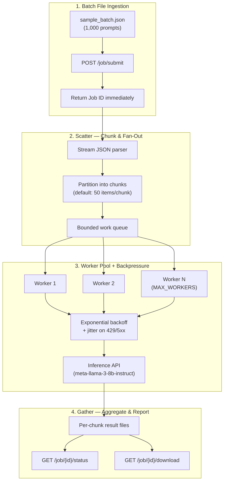

# Architecture

## System overview



## Component responsibilities

| Component | Role |
|-----------|------|
| **API layer** | Accepts jobs, returns immediately, serves status/download |
| **Job store** | Tracks job metadata, progress counters, chunk paths on disk |
| **Scheduler** | Reads input file in streaming fashion, enqueues chunks |
| **Worker pool** | Bounded concurrency; one HTTP call per prompt |
| **Backoff handler** | Retries 429/502/503/504 with exponential backoff + jitter |
| **Aggregator** | Writes chunk results to disk; merges on download |

## Memory model (avoiding OOM at 500K items)

1. **Input**: Use `ijson` or line-delimited streaming — never `json.load()` the full file.
2. **Execution**: Only `CHUNK_SIZE` items in flight per worker batch; queue depth capped by `MAX_WORKERS`.
3. **Output**: Each chunk writes to `data/jobs/{job_id}/chunk_{n}.jsonl`; download merges lazily.
4. **Status**: Maintain `{completed, failed, total}` counters — O(1) memory regardless of dataset size.

## Backpressure strategy

```
attempt = 0
while attempt < MAX_RETRIES:
    response = POST inference
    if response.ok: return result
    if response.status in (429, 502, 503, 504):
        sleep(min(MAX_BACKOFF, INITIAL_BACKOFF * 2**attempt) + random_jitter)
        attempt += 1
    else:
        record permanent failure; break
```

## Future extensions

- **DO Spaces streaming**: Flush each completed chunk to object storage for crash recovery.
- **Webhooks**: Register `callback_url` on submit; POST completion payload when job finishes.
