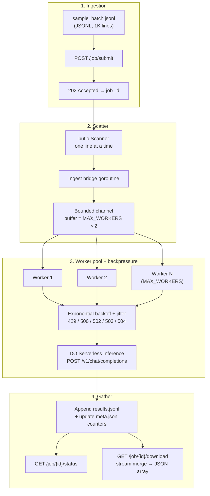

# Architecture

## System overview

Custom scatter-gather engine: the API accepts a job and returns immediately; a background runner streams JSONL input through a bounded channel into a fixed worker pool that calls DO Serverless Inference; results append to disk and download merges lazily into a JSON array.



## Request lifecycle

1. **Submit** — Count non-empty JSONL lines, create `data/jobs/{uuid}/meta.json` + empty `results.jsonl`, start `runner.ProcessAsync`.
2. **Run** — Set status `running`; stream items into a bounded channel; worker pool calls `InferenceClient.Complete` per row; append each `PromptResult` to disk and increment counters.
3. **Finalize** — Set status `completed`, `partial` (mix of row successes/failures), or `failed` (all rows failed).
4. **Status** — Read `meta.json` only; O(1) memory.
5. **Download** — Stream `results.jsonl` into `[` … `]` without loading all rows; reject with 409 if still `pending`/`running`.

## Component map

| Package / component | Role |
|---------------------|------|
| `internal/api` | Chi router; thin HTTP handlers |
| `internal/config` | Env-based tunables |
| `internal/ingest` | JSONL line scanner + line count |
| `internal/job` | Domain types, disk store (`meta.json`, `results.jsonl`), download merge |
| `internal/runner` | Background pipeline: ingest → channel → pool → store |
| `internal/worker` | Bounded pool, DO inference client, backoff |
| `cmd/server` | Wiring: config → store → client → runner → router |

On disk per job:

```
data/jobs/{job_id}/
  meta.json       # status, counters, timestamps
  results.jsonl   # one PromptResult JSON object per line (append-only)
```

## Backpressure and retries

Implemented in `internal/worker/backoff.go` and `internal/worker/inference.go`:

```
attempt = 0
while attempt <= MAX_RETRIES:
    response = POST inference
    if response.ok: return row result
    if status in (429, 500, 502, 503, 504):
        sleep(min(MAX_BACKOFF, INITIAL_BACKOFF × 2^attempt) + jitter)
        honor Retry-After when present
        attempt += 1
    else:
        record permanent row error; continue job
```

Non-retryable 4xx (400, 401, …) become per-row errors; the batch continues unless persistence fails.

## Operational ceilings

| Concern | Default / limit | Notes |
|---------|-----------------|-------|
| Concurrent inference | `MAX_WORKERS=10` | Process-wide cap via `LimitedCompleter`; each job also uses a pool of N workers |
| Queue backpressure | Channel size `MAX_WORKERS × 2` | Ingest blocks when full |
| Retries | `MAX_RETRIES=5` → up to 6 attempts | Per prompt row |
| Inference HTTP timeout | 30 seconds | Per upstream call |
| Backoff range | 1s – 60s + jitter | Configurable via env |
| Result files | Active `results.jsonl` plus sealed `chunks/chunk_N.jsonl` | No in-memory aggregation; chunks upload when Spaces is configured |
| `CHUNK_SIZE=50` | Seals `chunks/chunk_N.jsonl` every N rows; uploads when Spaces env is set |

## Memory model

Peak RAM is **O(MAX_WORKERS × average response size)**, not O(number of prompts).

| Phase | Strategy | Implementation |
|-------|----------|----------------|
| **Input** | Stream one JSONL line at a time | `internal/ingest/reader.go` — never load full file |
| **Execution** | Cap goroutines + bounded channel | `internal/worker/pool.go`, `internal/runner` |
| **Output** | Append-only disk writes | `internal/job/store.go` |
| **Download** | Stream merge to JSON array | `internal/job/stream.go` — no full-slice `json.Marshal` |
| **Status** | Counter fields in `meta.json` | O(1) regardless of dataset size |

## Scaling reference

| Scale | Input | Execution | Output |
|-------|-------|-----------|--------|
| 1K | Line scanner | 10 workers | Active `results.jsonl` |
| 100K | Same | Same pool | Rotate at `CHUNK_SIZE`; upload sealed chunks to Spaces |
| 500K | Never load all lines | Bounded goroutines + channel | Stream merge on download |

## Input format note

Interview spec text described a JSON **array** file; clarified requirement is JSONL for ingest streaming. Download intentionally returns a JSON **array** for downstream consumers that expect aggregated output.

## Extensions (implemented)

- **DO Spaces** (`internal/storage/spaces.go`) — uploads sealed chunks via S3-compatible API when `SPACES_*` env vars are set.
- **Webhooks** (`internal/webhook/notifier.go`) — optional `callback_url` on submit; POST completion payload when job reaches terminal status.

## Phase 2 (sketched, not implemented)

**Global work queue** — one fixed worker fleet and shared bounded queue for all jobs, instead of `MAX_WORKERS` goroutines per job. Fixes multi-job goroutine and queue memory growth while keeping JSONL ingest per job.

See the full design (types, wiring, migration steps, effort): [DECISIONS.md — Global work queue sketch](../DECISIONS.md#global-work-queue-sketch-phase-2).

## External references

- [Serverless Inference](https://docs.digitalocean.com/products/inference/how-to/use-serverless-inference/)
- [Batch Inference API](https://docs.digitalocean.com/reference/api/reference/batch-inference/) (reference — not used for orchestration)
